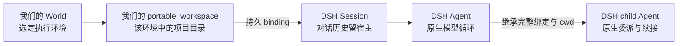
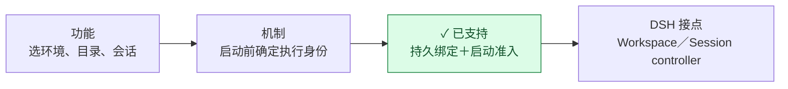
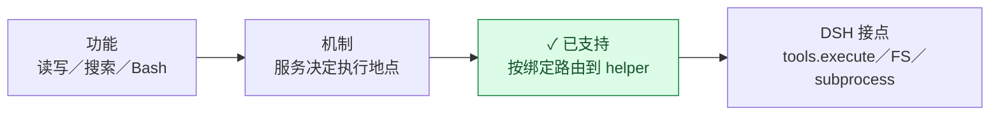
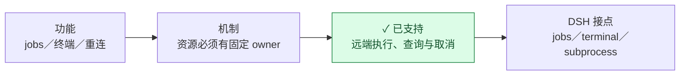
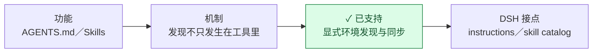
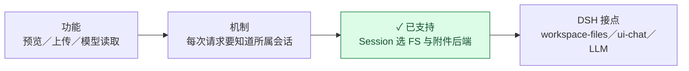
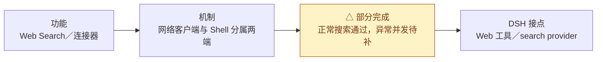
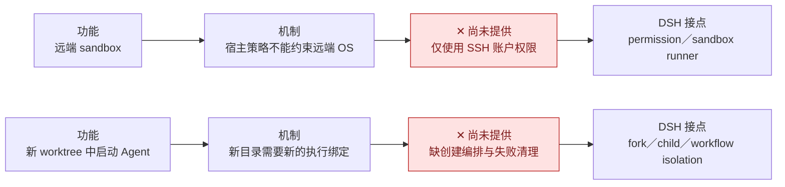
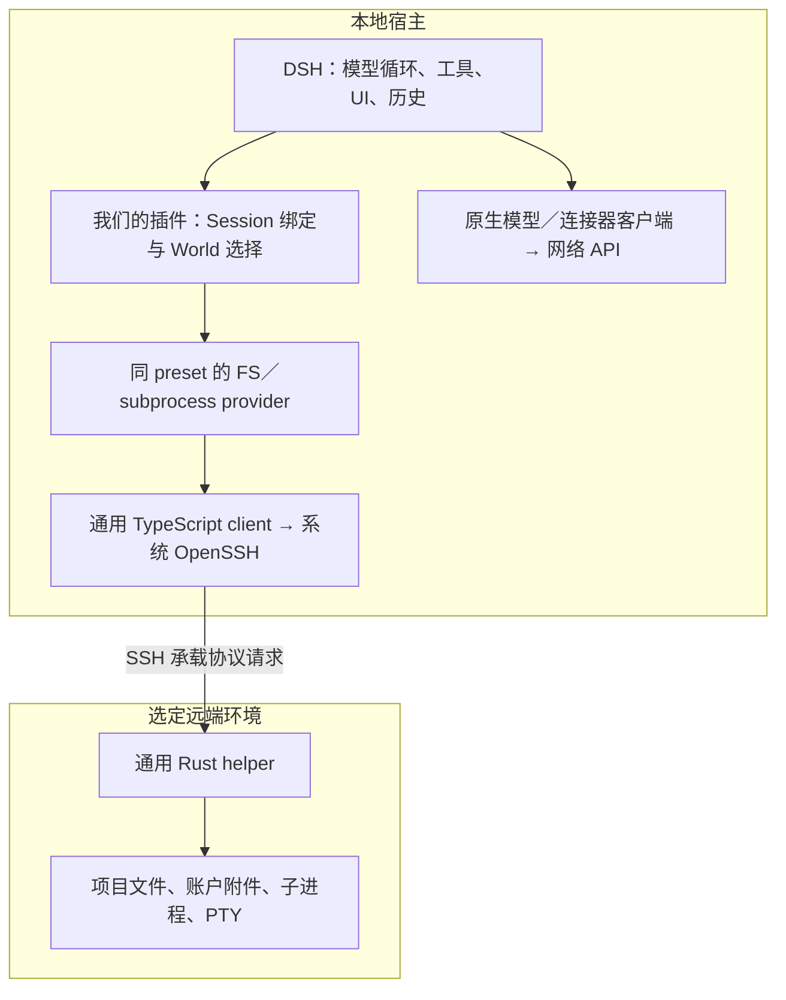
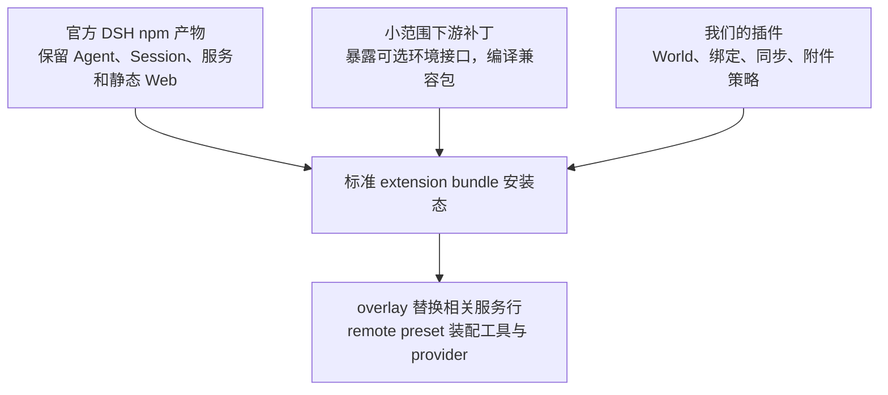

# 系统全景：从用户功能到 DSH 基础设施

这份图解回答四个相连的问题：**用户要做什么 → 底层难点是什么 → 我们怎样处理 → 接在 DSH 的什么概念和设施上。** 架构、执行边界和插件兼容都沿这条主线解释。

颜色只表示交付状态，不表示模块归属：🟢 **已支持**节点写明的范围；🟡 **部分完成**，仍需适配或专项验收；🔴 **尚未提供**。每个彩色节点同时带文字。状态依据仓库已有实现与验收，不代表本次重新验收、所有平台可用或已公开发布。[当前计划](../.agents/notes/proposed/integration/2026-09-07-world-portable_workspace-web.md)维护后续工作。

阅读顺序：[概念关系](#先认识这些概念) → [功能链](#功能怎样落到上游设施) → [整体装配](#这些功能怎样装在一起) → [接入与升级](#新增消费者与升级) → [源码与证据](#源码与证据)。

## 先认识这些概念

**DSH 留在本地管理对话，我们为它接入选定远端的文件和进程能力。** 项目路径由远端解释；模型请求、插件代码和 Session 历史仍在宿主。
  ∑
| 概念／设施 | 谁提供 | 在这里负责什么 |
| --- | --- | --- |
| Session | DSH | 保存对话和历史；不是 SSH 连接。我们另外保存它的执行绑定 |
| Agent、child、continuation | DSH | 执行模型循环、委派和续接；复用原生生命周期与工具过滤 |
| Workspace、workspace controller | DSH | 工作区列表与操作入口；我们通过外部 feed 接入远端目录 |
| World、portable_workspace、binding | 本项目 | World 描述环境；portable_workspace 表示其中的 canonical 项目目录；binding 固定 Session 的执行身份 |
| FS、subprocess、shell、jobs、terminal | DSH 接口与消费者 + 我们的 provider | 工具继续调用服务，我们把文件和进程操作交给远端 |
| Cordis、profile、preset | DSH 使用的插件基础设施 | 注册和装配服务，决定消费者拿到哪个实例；不等于 OS 安全隔离 |
| Remote、Typert、client factory | DSH 的宿主／浏览器基础设施 | UI 与服务通信、模块加载和协议身份；这里的 Remote 不表示 SSH World |
| client、OpenSSH、helper | 本项目运行库 + 系统 SSH | 从宿主传递协议请求，在目标环境读写文件、管理进程和 PTY |

World catalog 和具体执行绑定有区别：v1 `WorldDefinition` 同时含 SSH 坐标与 cwd，registry 为每个组合生成 binding ID。同名 cwd 不能标识同一 World。child 沿 parent lineage 找顶层 portable_workspace，逐级核对完整绑定，不成为顶层列表成员。提交顺序见 [Session bindings](reference/session-bindings.md)。

## 功能怎样落到上游设施

每张功能图均按 **功能 → 机制 → 我们的方案／状态 → 上游接点** 阅读。图后的说明区分“复用上游”“插件扩展”“下游补丁”，不把本项目增加的接口写成上游原生能力。0001–0007 对应[补丁清单](../integrations/dsh/patches/series.json)。

### 打开远端项目，创建和恢复会话

DSH 提供 Workspace 导航、Session 创建／恢复／fork 和 Remote/store。上游原本会在 preset 准备前处理本地目录；仅替换工具服务拦不住这一步。**0001 增加可等待的 Session 准入，0002 增加外部 workspace feed**；我们的 `portable-workspace` 插件负责 registry、持久 membership、目录与 World 校验。

恢复以保存的 binding 为准，不跟随 UI 当前选择。普通 fork 和 child 保留原环境与 cwd；continuation 保留原生 child Session 和工具过滤。缺失、损坏、冲突或不可用的绑定必须失败，不能用宿主同名目录或另一容器兜底。实现见[准入](../integrations/dsh/packages/workspace/portable-workspace/src/admission.ts)与 [World 管理](../integrations/dsh/packages/world/ssh-world/src/worlds.ts)。

### 读写、搜索和运行命令

复用原生文件、搜索和 Bash 工具。我们的 `ssh-world` 在 `tools/execute` hook 里根据 Session 查 binding，用 AsyncLocalStorage 保存本次调用的 World provider；`ctx.fs` / `ctx.subprocess` 经 client、SSH 转发到 helper。**0003 为 Bash 接入所属 Agent 的 workdir resolver，0004 让文件工具用注入 FS 解析 cwd**，避免路径提前在宿主解析。

路径、symlink 和 `..` 由目标 FS 解释；未打路径补丁的组合继续拒绝 `..`。shell、可执行文件和路径规则按目标平台选择。只传明确的 `spec.env`，不复制宿主 `process.env`。仅 DSH 已知 packaged ripgrep 路径映射到目标 rg；其他 argv[0] 仍发远端，这不是命令白名单或 Shell 字符串改写。实现见[路由](../integrations/dsh/packages/world/ssh-world/src/routing.ts)。

### 后台任务、终端和断线恢复

原生 jobs/terminal 服务管理 Session owner 和关闭生命周期；我们的 terminal backend 把创建操作交给该 World 的 subprocess。helper 管底层资源，不接管 Agent 或审批。后台回调保存具体 owner/provider/句柄，不根据后来选中的 UI 重选 World。

World、SSH 连接、helper runtime epoch 和 process ID 是不同身份。只在有限宽限期内重连同一个活跃 runtime；宿主重启准备新 runtime，不恢复旧句柄，也不重放结果不确定的命令。**🔴 独立终端面板尚未提供**，已有终端工具不代表已有面板。

### 让 Agent 读到正确的项目指令与 Skills

复用 DSH 的指令生命周期、skill frontmatter、parser、catalog、调用权限和 `skill` 工具。**0005 增加 Agent instruction environment、Session-aware skill lookup 与可关闭的缓存**；`remote-skills` 插件提供远端发现、显式部署和同步。

当前来源为项目 `.dsh/skills`、项目 `.agents/skills`、远端 home `.agents/skills`，依次优先。未隐式扫描宿主默认 skills 或合并宿主个人 AGENTS.md。无远端 watcher，catalog 每次请求重新发现；已进入历史的说明不追溯替换。选定本地内容可部署到远端，但本地脚本路径、应用、凭据和依赖不会因此自动远端可用。**Skill 的位置不授予执行权**。配置、同步和冲突处理见 [Skills 使用指南](skills.md)。

### 浏览文件、图片和上传附件

DSH rc.1 原生文件地址保留 Session 身份。**0006 为 workspace-files 和媒体增加 Session 所属 FS/root**；`portable-workspace` 按持久绑定解析冷会话及子会话的远端预览环境。普通文件读取允许 SSH 账户有权读取的项目外路径；目录和变更流仍限项目根，最终 symlink 拒绝。原生 `present` 文件交付可在侧栏打开，宿主 Open/Reveal 禁用。无 OS watcher，外部编辑手动刷新。

**0007 让上传、工具、模型转换、历史预览、导出与子 Agent 传递 Session，并允许后端提供执行路径**。我们的 `remote-attachments` 通过 `attachments.forSession(sessionId)` 选择远端持久源。DSH 继续负责图片校验／归一化、模型编码和原生日志格式。模型按需读回，工具获得远端路径；宿主缓存不可替代失效的远端源。

原样文件当前上限 64 MiB；旧裸摘要引用继续读旧宿主 store，远端工具需要时重新上传。**🔴 自动迁移、存储 GC 和跨 World 转移未提供**。精确命名空间、原子发布、旧 helper 与 profile 兼容见[文件预览与附件契约](reference/workspace-io.md)。

### 搜索网络、调用本地连接器

remote preset 装配原生 Web 工具和宿主 DeepSeek search provider；请求使用宿主网络和凭据。Shell 中的 `curl` 或搜索 CLI 则使用远端网络，不能按关键词改向。受控宿主端点与真实外部搜索已验收；双 Session 并发、失败／超时／取消仍需专项验收，不能推及任意连接器。

本地 API 需要远端项目数据时，明确执行 **远端读取／导出 → 授权传递 → 本地 API**；写回同样显式。连接器失败不切换为远端 CLI，也不获得通用本地 Shell。模型 API、Agent loop、插件 JS、Session JSONL、配置、catalog、binding 和产物 cache 留在宿主。

### 权限隔离和自动 worktree

**Workspace 是工作目录，不是权限围栏。** 目前仅允许 `danger-full-access`，其他模式在写入前拒绝；remote overlay 禁用原生 permission/UI，不承诺逐次审批界面。tool allow/deny 只控制可见性与调用权限，允许 Bash 就仍可执行命令。执行事实可以投影给模型和审批，不代表已有远端强制隔离；helper 参数／资源检查也不隔离同进程插件的任意本地代码。

worktree 已有可组合基础：远端 subprocess 可运行目标 Git，registry 可登记已有目录并创建绑定的新独立 Session。尚未形成“创建 worktree → 注册目录 → 启动 Agent → 失败清理”的产品流程；目标 Git／仓库条件也未专项验收。普通 child 必须继承完整 binding/cwd，Web fork 复制源 cwd，上游 workflow isolation 仍是 deferred 选项，不能仅改 cwd 绕过检查。后续定界见[worktree 计划](../.agents/notes/proposed/integration/2026-09-07-world-portable_workspace-web.md#远端-worktree待处理)。

## 这些功能怎样装在一起

### 一次调用跨过哪些层

工具路由是临时上下文；初始化、指令、预览、附件等入口使用显式 Agent/Session 身份，不假设 `tools/execute` 已运行。缺少路由上下文必须报错。OpenSSH 复用用户配置、公钥认证、host verification 和 ProxyJump；配置可能有用户显式设置的转发行为。连接编排通过 SSH 安装 helper/rg、准备 runtime，这不是另一套 Agent Shell。

### Cordis、preset 与模块身份为什么重要

服务注册并不是“名字相同就接上了”。FS、subprocess、shell、workdir resolver 在同一个 standing preset 隔离域中，Agents 加入该域，共享原生工具实例。`bundle/remote` 按依赖装配同步、World owner、feed、registry 和消费者；**feed 与 Remote namespace 必须先于依赖它们的 controller/UI 激活**，否则可能启动等待或缺服务。

源码目录不表示独立 npm 发行，也不表示单一 Cordis 实例。兼容包相互引用必须在构建期指向同一份包内实现，保留 package、client factory、Typert 的身份。不能靠 Node resolve hook 修补实例冲突。装配入口见 [bundle](../integrations/dsh/packages/bundle/remote/src/index.ts)。

### 插件、补丁、官方产物各负责哪一层

统一安装方式是官方 DSH 加标准 extension bundle。只编译受补丁影响的兼容包和本项目插件；overlay 按包内相对路径装配，其余服务与静态 Web 沿用官方产物。ui-chat 浏览器模块从补丁源码单独构建；DSH 通过插件文件最近的 `package.json` 发现浏览器模块和 inventory。普通依赖通过官方 profile fallback 解析，不修改官方安装。

配置插件在兼容服务激活前检查宿主版本。附件等替换行使用 disable + insert，include 的 `name` 是匹配断言，不能替换实现；自定义 profile 的 `remote-*` 行与配置键规则见[附件契约](reference/workspace-io.md#上传附件)。完整模板见 [overlay/preset 装配](../integrations/dsh/packaging/extension/README.md)。

## 新增消费者与升级

### 接上相同设施，才谈得上插件兼容

**🟡 当前是逐个消费者适配；🔴 没有任意插件自动兼容检测或稳定公开 World SDK。** Loader 能加载只证明模块可加载。直接 `node:fs`、`spawn`、`execFile` 或本地 SDK 都会绕过 World 服务；即使使用安全 argv，也仍在宿主执行。

| 消费者要做什么 | 应接的身份／设施 | 我们的边界 |
| --- | --- | --- |
| 工具中的项目读写／搜索／进程 | 当前 Session；同 preset 的 `ctx.fs` / `ctx.subprocess` | 不用宿主 cwd、路径前缀或工具名猜环境 |
| 初始化、后台、API 中的项目操作 | 按 admission 准备；`executionWorlds.forAgent(agent)` 或已有 Session 专属入口 | 不依赖临时 ALS，不用 UI 当前选择；后台捕获 owner/provider/句柄 |
| 附件上传／模型读取／预览／导出 | `attachments.forSession(sessionId)` | 保留来源 World，不用宿主副本兜底 |
| 连接器与插件控制数据 | 明确的宿主网络／存储接口 | 只传所需数据，不把凭据或所有文件操作搬到远端 |
| 指令与 skill 资源 | 显式 Agent/Session 的环境发现 | 来源不授予执行权限，依赖不偷偷复制 |

未适配的 workspace 消费者必须排除；本项目不全局 monkey-patch Node，也不隔离恶意同进程插件。原生 sameWorkspace 会话引用只比较 cwd，当前排除；LSP/Git 扩展、跨根 Agent 消息和外部 Agent 后端需单独适配。实现参考[非工具预览入口](../integrations/dsh/packages/workspace/portable-workspace/src/file-preview.ts)和[路由／executionWorldContext](../integrations/dsh/packages/world/ssh-world/src/routing.ts)；事实投影不含 SSH 凭据。

### 验收证明哪一层成立

| 验收层 | 必须看到什么 |
| --- | --- |
| unchanged-source | 固定的原生上游到底提供了什么、缺了什么；保留未改源码 gate |
| patched-host | 下游补丁补上接口，并保留原生 local create/resume 等行为 |
| 双 Linux／SSH World | 宿主与两 World 同路径不同内容；操作只到指定环境，后台和双 Session 不串线；World 停止或 binding 丢失明确拒绝 |
| 官方 CLI 安装态与浏览器 | 同一 tarball 可装配，UI/API、冷启动、fork/child、附件、terminal 保持身份；不能只测源码函数 |

控制数据留宿主，连接器凭据不进入远端 env 或公开产物。新消费者通过适用场景后才声明支持；现有绿色功能也不代表后续所有竞态已测完。生命周期强化、连接器异常并发等仍见[当前计划](../.agents/notes/proposed/integration/2026-09-07-world-portable_workspace-web.md)。本机 fixture 不替代目标平台或浏览器证据。

### 上游升级时看什么

优先复用可组合接口，只有宿主缺少入口才维护补丁；上游补齐后逐个移除补丁及兼容包。不能因为出现同名接口就删除补丁：还需验证准入时序、身份传递、失败语义、服务域与浏览器模块身份。

[series.json](../integrations/dsh/patches/series.json)是官方版本、revision、修改包和补丁摘要的唯一配置源。版本检查仅提前拒绝不支持的组合，不证明语义兼容。按“原生 gate → patched-host → 扩展安装／SSH／浏览器 → 发行候选”验证；Session V2→V3 迁移后回退需恢复状态备份，不能只降 npm 版本。逐项风险、七个补丁的移除条件与升级顺序见[上游升级参考](reference/upstream-upgrades.md)，命令见[开发指南](development.md)。

## 源码与证据

| 目录／模块 | 在上述链路中的职责 |
| --- | --- |
| `runtime/helper/` | 通用远端文件、进程、PTY、协议；独立 Cargo manifest/lockfile，使用自己的默认 target/ |
| `runtime/client/`、`runtime/ssh/` | 通用 Node 协议客户端、OpenSSH、安装/bootstrap；不导入 DSH API |
| `runtime/tests/`、`runtime/scripts/` | 通用 runtime 测试与产物准备 |
| `integrations/dsh/packages/world/ssh-world/` | World、绑定、路由、账户权限、terminal backend |
| `integrations/dsh/packages/workspace/` | portable-workspace 的 registry/准入/UI；remote-attachments 的 Session 附件策略 |
| `integrations/dsh/packages/skill/`、`bundle/` | Skills 发现／同步；整体装配和激活顺序 |
| `integrations/dsh/shared/` | 少量共享工具，不存 World/Session 领域逻辑 |
| `integrations/dsh/patches/`、`packaging/` | 固定上游、有序补丁；overlay/preset 与构建输入，不保存完整上游源码 |
| `integrations/dsh/tests/`、`scripts/` | DSH 适配、独立 gates、安装态验收与发行 |

模块入口见[源码索引](../integrations/dsh/packages/README.md)，构建产物的生命周期见[开发指南](development.md)。

| 证据记录 | 主要覆盖 |
| --- | --- |
| [Skills 与消费者](../.agents/notes/implemented/integration/2026-09-08-skills-consumers-acceptance.md) | 指令、skill、同路径双 World、后台任务、部署与同步 |
| [child、终端与真实搜索](../.agents/notes/implemented/integration/2026-09-08-child-terminal-source-acceptance.md) | 继承、续接、终端、真实模型／外部搜索；当时源码交付的历史范围 |
| [原生 bundle](../.agents/notes/implemented/integration/2026-09-08-native-bundle-delivery.md) | 替代源码宿主的标准扩展交付与安装 |
| [DSH rc.1 适配](../.agents/notes/implemented/integration/2026-09-10-dsh-rc1-upgrade.md) | 原生文档预览、导航、catalog 失败清理及完整安装态回归 |
| [DSH 新版适配](../.agents/notes/implemented/integration/2026-09-09-dsh-upgrade.md) | 范围读取、预览、V2/V3 与安装回归 |
| [远端附件](../.agents/notes/implemented/integration/2026-09-10-remote-attachments.md) | 持久源、模型读取、上传／预览／fork／重启及旧引用 |

记录只证明当时声明的范围，历史路径原样保留。`docs/` 解释当前契约和用法，`.agents/notes/` 保存计划、决策与有日期的证据；不把历史成功自动升级成最新 CI 或公开发行承诺。
