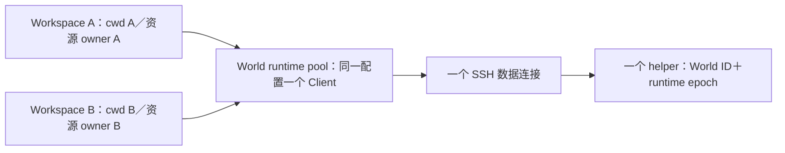
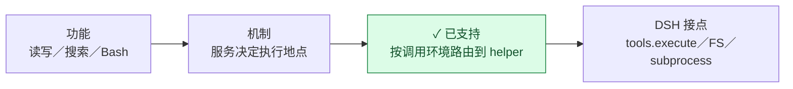
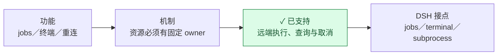
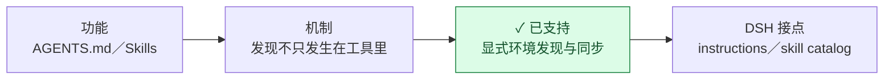
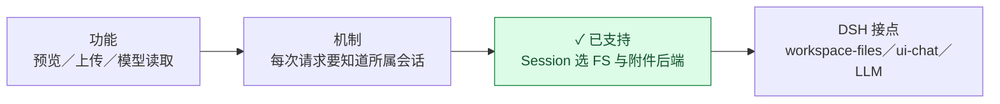
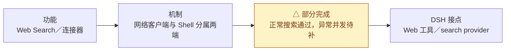
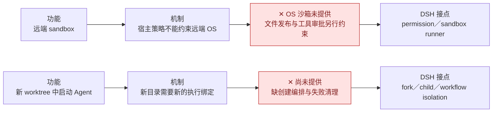
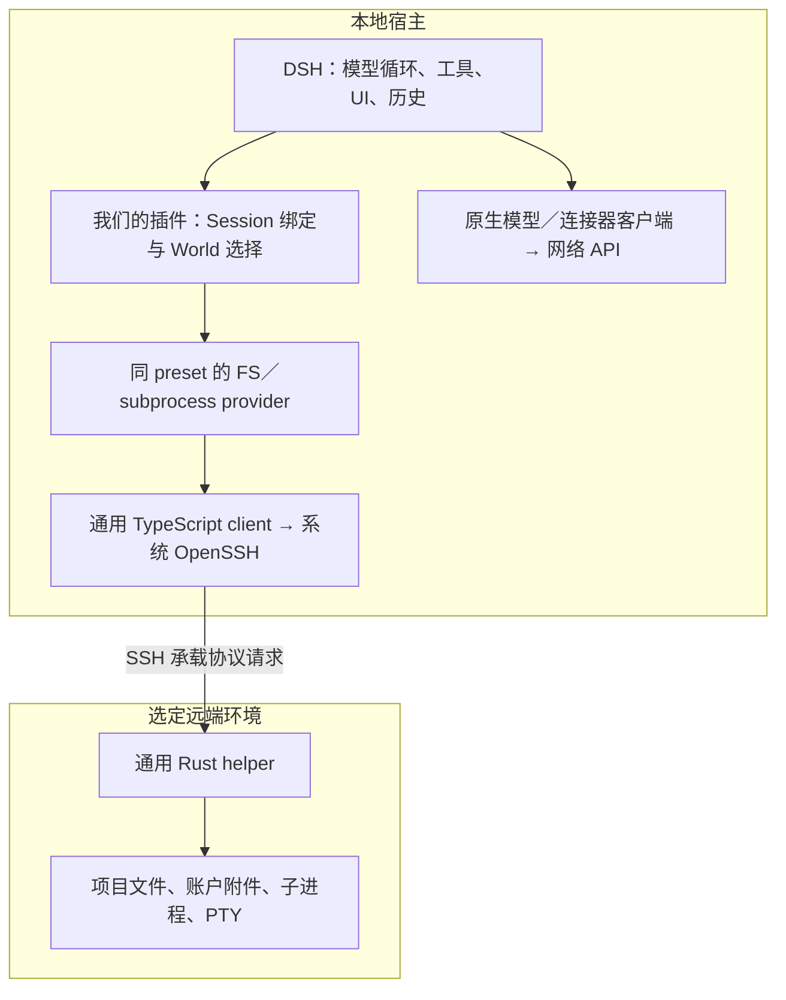
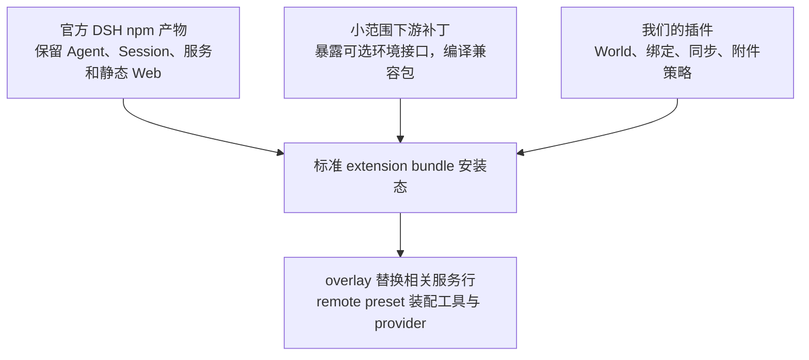

# 系统全景：从用户功能到 DSH 基础设施

这份图解回答四个相连的问题：**用户要做什么 → 底层难点是什么 → 我们怎样处理 → 接在 DSH 的什么概念和设施上。** 架构、执行边界和插件兼容都沿这条主线解释。

颜色表示功能状态：🟢 已支持；🟡 部分完成；🔴 尚未提供。支持范围以各节说明为准，后续工作见[当前计划](../.agents/notes/proposed/integration/2026-09-07-world-portable_workspace-web.md)。

阅读顺序：[概念关系](#先认识这些概念) → [功能链](#功能怎样落到上游设施) → [整体装配](#这些功能怎样装在一起) → [接入与升级](#新增消费者与升级) → [源码与证据](#源码与证据)。

## 先认识这些概念

**DSH 留在宿主管理对话，项目操作按本次调用的执行环境选择本机或 SSH provider，默认使用 Session binding。** 本机复用原生能力；SSH 项目路径由远端解释。模型请求、插件代码和 Session 历史仍在宿主。

| 概念／设施 | 谁提供 | 在这里负责什么 |
| --- | --- | --- |
| Session | DSH | 保存对话和历史；不是 SSH 连接。我们另外保存它的执行绑定 |
| Agent、child、continuation | DSH | 执行模型循环、委派和续接；复用原生生命周期与工具过滤 |
| Workspace、workspace controller | DSH | 原生本机 registry 与远端目录经统一 facade/feed 进入同一选择器 |
| World、portable_workspace、binding | 本项目 | World 描述环境；portable_workspace 表示其中的 canonical 项目目录；binding 固定 Session 的默认执行身份 |
| FS、subprocess、shell、jobs、terminal | DSH 接口与消费者 + 我们的 provider | 工具按显式 World 使用原生本机服务或 SSH provider |
| Cordis、profile、preset | DSH 使用的插件基础设施 | 注册和装配服务，决定消费者拿到哪个实例；不等于 OS 安全隔离 |
| Remote、Typert、client factory | DSH 的宿主／浏览器基础设施 | UI 与服务通信、模块加载和协议身份；这里的 Remote 不表示 SSH World |
| client、OpenSSH、helper | 本项目运行库 + 系统 SSH | 从宿主传递协议请求，在目标环境读写文件、管理进程和 PTY |

[identity.ts](../integrations/dsh/packages/world/execution-world/src/identity.ts) 定义四种身份：World 是不含 cwd 的执行环境；Workspace 是该环境中的 canonical 项目目录与目标配置快照；binding 将 Session 绑定到 Workspace；runtime epoch 标识 helper 的一次运行。不同 World 可以有相同路径，完整定义与持久化规则见 [Session bindings](reference/session-bindings.md)。

同一 DSH 宿主进程内，`WorldRuntimePool` 按 World ID 与目标配置指纹共享 Client、SSH 数据连接和 helper。每个 `RemoteWorkspace` 保存自己的 cwd 和资源 scope。协议 `world` 使用 World ID，文件解析和进程执行显式传入目录。

Workspace view 关闭时先清理自己的请求、文件流、进程与 PTY，再归还 runtime lease；最后一个 lease 关闭 runtime。授权绑定 Workspace 的资源 scope。view 由宿主服务缓存，Session 结束不自动驱逐 Workspace；重连保持同一 epoch。连接与清理的完整规则见 [bootstrap 契约](reference/bootstrap.md)。

`portable_workspaces` 保存工作区与 membership；`workspace_presentation` 保存置顶和归档，World 颜色与 skill 选择来自配置。展示状态独立于执行身份和 workspace 时间戳，通过原生 membership feed 与独立 `followWorlds` stream 更新。用法见 [World 配置](reference/worlds.md)。

## 功能怎样落到上游设施

功能图按 **功能 → 机制 → 方案 → 上游接点** 阅读。补丁版本与修改包见 [series.json](../integrations/dsh/patches/series.json)。

### 打开本机或 SSH 项目，创建和恢复会话

DSH 提供 Workspace 导航、Session 创建／恢复／fork 和 Remote/store。上游原本会在 preset 准备前处理本地目录；仅替换工具服务拦不住这一步。**0001 增加可等待的 Session 准入，0002 增加外部 workspace feed**；我们的 `portable-workspace` 插件负责 registry、持久 membership、目录与 World 校验。

新会话入口读取 [worlds.json](reference/worlds.md)，选中后连接并登记 canonical 目录。**Reload worlds** 预览并应用配置与 skill 更新，已有 Session 保留原绑定。侧栏使用原生 New Session 控件，workspace 插件提供 Reload worlds 和会话卡片。

**This computer → Choose a folder…** 复用原生目录选择器，并与原生最近工作区合并。本机不经 SSH、helper 或远端 skill 部署。0010（文件名 `0010-local-workspace-admission.patch`）为准入增加可选 preset 选择，并允许 native registry 禁用按 cwd 自动归类历史；未配置这些入口的原版行为不变。新本机会话通过显式目录选择建立绑定；未绑定的历史本机会话不自动采用。

恢复以保存的 binding 为准，不跟随 UI 当前选择。普通 fork 和 child 保留原环境与 cwd；continuation 保留原生 child Session 和工具过滤。缺失、损坏、冲突或不可用的绑定必须失败，不能用宿主同名目录或另一容器兜底。实现见[准入](../integrations/dsh/packages/workspace/portable-workspace/src/admission.ts)与 [World 管理](../integrations/dsh/packages/world/execution-world/src/worlds.ts)。

### 本机 leader 跨 World 委派

0011 为原生 spawn child 提供可等待的执行环境准备入口；`child-environment` 插件在原生 Agent 初始化前校验、绑定和选择目标 preset。Team、child Session、工具过滤、消息和完成通知仍由 DSH 管理。`world-tools` 提供已配置 World 发现与 Workspace 准备；模型通过原生 subagent 委派具体任务。普通 child 默认继承，显式跨 World child 保持父子关系并按保存绑定续接。World ID 与 Workspace ID 的用法见[跨 World 委派](reference/cross-world-delegation.md)。

### Experimental Agent Teams

标准与 SSH preset 装配原生 experimental Team service、协调工具和 Web 面板。0013 将 teammate 的可选 Workspace ID 透传到 0011 的 child 执行环境入口，并按原生子会话身份识别团队成员。成员、任务板和 mailbox 都保存在宿主 Lead Session，项目 IO 按成员环境分派。

0014 使用原生浮层定位 hook 与 Portal，使 Team 面板在视口内随窗口缩放和滚动重新定位。

Teams 工具管理团队成员，原生 subagent 用于一次性委派。任务 writeScopes 提供共享路径的重叠提示。创建、续接和权限边界见 [Agent Teams](reference/agent-teams.md)。

### 读写、搜索和运行命令

复用原生文件、搜索和 Bash 工具。`execution-world` 在 `tools/execute` hook 里解析本次调用的 World provider 与 cwd，省略选择时使用 Session binding；SSH 操作经 client 转发到 helper。**0003 为 Bash 接入所属 Agent 的 workdir resolver，0004 让文件工具用注入 FS 解析 cwd**，避免路径提前在宿主解析。

`execution-world` 管理 binding、准入和分派；`local-world` 借用原生 FS/subprocess，`ssh-world` 管理共享 runtime 与远端 providers。Standard 和 remote preset 分别组合本机、SSH 能力，绑定决定执行环境。本机使用原生 sandbox；SSH 工具经原生 approval 服务和目录约束发布执行，[权限规则](#权限隔离和自动-worktree)统一说明。

路径、symlink、`..` 和可执行文件由目标平台解析。进程环境只接收显式 `spec.env`；适配器将 DSH packaged ripgrep 的精确路径映射到目标 rg，其余 argv 原样发送。实现见[路由](../integrations/dsh/packages/world/execution-world/src/routing.ts)。

### 不切换 Workspace 的临时跨 World 调用

**0012 提供可选执行环境接口和声明式操作描述**。文件、搜索、Bash 和终端创建等工具可选择 World/cwd；job/terminal 后续操作按资源 ID 取回创建时的环境。`call-environment` 统一准备目标，供 FS、shell、subprocess、权限与审批使用。

临时调用保留 Session 的绑定、成员关系、展示状态和指令／Skills，文件结果与后台句柄保留本次来源。参数、工具清单和授权规则见[工具执行环境](reference/tool-execution.md)。

### 后台任务、终端和断线恢复

原生 jobs/terminal 服务管理 Session owner 和关闭生命周期；我们的 terminal backend 把创建操作交给该 World 的 subprocess。helper 管底层资源，不接管 Agent 或审批。后台回调保存具体 owner/provider/句柄，不根据后来选中的 UI 重选 World。

World、SSH 连接、helper runtime epoch 和 process ID 是不同身份。只在有限宽限期内重连同一个活跃 runtime；宿主重启准备新 runtime，不恢复旧句柄，也不重放结果不确定的命令。**🔴 独立终端面板尚未提供**，已有终端工具不代表已有面板。

### 让 Agent 读到正确的项目指令与 Skills

复用 DSH 的指令生命周期、skill frontmatter、parser、catalog、调用权限和 `skill` 工具。**0005 增加 Agent instruction environment、Session-aware skill lookup 与可关闭的缓存**；`remote-skills` 插件提供远端发现、显式部署和同步。

SSH 的指令与 skill 发现使用远端项目和账户目录，部署可复制选定的本地 skill 内容。来源、优先级、更新方式和同步冲突见 [Skills 配置与发现契约](reference/skills.md)。Skill 位置与内容不授予额外执行权限。

本机复用原生 skill provider 名称、默认来源、watcher 与指令环境；两种 provider 按保存的 Session binding 分派。

### 浏览文件、图片和上传附件

原生文件地址保留 Session 身份。**0006 为 workspace-files 和媒体提供 Session 所属 FS/root**；`portable-workspace` 按绑定解析冷会话和子会话的预览环境。显式调用产生的文件引用保留目标 World，工具详情与 `present` 按引用打开原生侧栏预览。

**0007 向附件消费者传递 Session，并允许后端提供执行路径**。`remote-attachments` 通过 `attachments.forSession(sessionId)` 选择存储；DSH 负责图片校验、模型编码和日志格式。

本机附件使用原生 AttachmentStore，SSH 附件以远端为持久源。读取范围、symlink 检查、上传限额、引用格式和缓存规则见[文件预览与附件契约](reference/workspace-io.md)。

**🔴 附件存储 GC 和跨 World 转移未提供**；外部文件编辑需手动刷新，宿主 Open/Reveal 操作对远端文件禁用。

### 搜索网络、调用本地连接器

remote preset 装配原生 Web 工具和宿主 DeepSeek search provider；请求使用宿主网络和凭据。Shell 中的 `curl` 或搜索 CLI 则使用远端网络，不能按关键词改向。受控宿主端点与真实外部搜索已验收；双 Session 并发、失败／超时／取消仍需专项验收，不能推及任意连接器。

本地 API 需要远端项目数据时，明确执行 **远端读取／导出 → 授权传递 → 本地 API**；写回同样显式。连接器失败不切换为远端 CLI，也不获得通用本地 Shell。模型 API、Agent loop、插件 JS、Session JSONL、配置、catalog、binding 和产物 cache 留在宿主。

### 权限隔离和自动 worktree

**Workspace 是工作目录，不是 OS 权限围栏。** SSH 不提供 OS 级沙箱。本机继续使用原生 sandbox；Remote 保留原生权限服务、菜单和预设表。SSH 模型工具的规则如下：

| 模式与操作 | 行为 |
| --- | --- |
| Full access 下的工具调用 | 不经此审批关卡；项目 IO 使用 SSH 账户权限 |
| 其他模式的 read 类工具（文件、搜索、预览、job/terminal 读取） | 免审批读取账户可读文件，包括工作区外路径 |
| Workspace Write 的工作区内 `write` / `edit` | helper 支持 `fs.rooted-publish` 时免审批；否则请求审批 |
| Read Only 的写入、工作区外或其他 World 写入、其余工具（包括 Bash） | 请求原生审批；只有 `allowed-once` 才执行 |

免审批写入在远端解析真实路径、检查工作区范围，并持有目标父目录与暂存目录句柄完成发布，防止路径被替换成符号链接后重定向。此约束针对一次文件发布，不约束任意进程，也不阻止同账户将已打开的目录移到别处。

需要审批的操作遇到拒绝、取消、无可用回答者或 `never` 策略时不执行；等待期间权限变更使授权失效。批准的项目文件和进程操作使用 SSH 账户权限，可能访问工作区外路径。Web API 等宿主连接器仍按前述入口使用宿主网络和凭据。因此 SSH 的 Read Only 表示写入需要审批，并非 OS 强制只读。一次批准覆盖该次工具操作及其进程生命周期，不是逐系统调用审查。人类审批理由展示操作、位置和权限范围，模型上下文另提供完整 World 信息。

连接、目录发现、附件与浏览器文件预览仍由各自明确的用户操作和 Session 绑定入口管理，不经过模型工具调用关卡。

远端 subprocess 和 registry 可用于运行 Git、登记目录；自动 worktree 尚缺创建、绑定、启动和失败清理的完整编排。后续工作见[worktree 计划](../.agents/notes/proposed/integration/2026-09-07-world-portable_workspace-web.md#远端-worktree待处理)。

## 这些功能怎样装在一起

### 一次调用跨过哪些层

工具调用使用临时路由上下文；初始化、指令、预览和附件使用显式 Agent/Session 身份。缺少路由上下文必须报错。OpenSSH 负责认证与传输，连接编排负责安装 helper/rg 和准备 runtime，见 [bootstrap](reference/bootstrap.md)。

### Cordis、preset 与模块身份为什么重要

服务注册并不是“名字相同就接上了”。FS、subprocess、shell、workdir resolver 在同一个 standing preset 隔离域中，Agents 加入该域，共享原生工具实例。`bundle/remote` 按依赖装配同步、World runtime pool 与 Workspace views、feed、registry 和消费者；**feed 与 Remote namespace 必须先于依赖它们的 controller/UI 激活**，否则可能启动等待或缺服务。

源码目录不表示独立 npm 发行，也不表示单一 Cordis 实例。兼容包相互引用必须在构建期指向同一份包内实现，保留 package、client factory、Typert 的身份。不能靠 Node resolve hook 修补实例冲突。装配入口见 [bundle](../integrations/dsh/packages/bundle/remote/src/index.ts)。

### 插件、补丁、官方产物各负责哪一层

统一安装方式是官方 DSH 加标准 extension bundle。只编译受补丁影响的兼容包和本项目插件；overlay 按包内相对路径装配，其余服务与静态 Web 沿用官方产物。受影响的 ui-chat、工具详情、文件交付与侧栏浏览器模块从补丁源码单独构建；DSH 通过插件文件最近的 `package.json` 发现浏览器模块和 inventory。普通依赖通过官方 profile fallback 解析，不修改官方安装。

配置插件在兼容服务激活前检查宿主版本。附件等替换行使用 disable + insert，include 的 `name` 是匹配断言，不能替换实现；自定义 profile 的 `remote-*` 行与配置键规则见[附件契约](reference/workspace-io.md#上传附件)。完整模板见 [overlay/preset 装配](../integrations/dsh/packaging/extension/README.md)。

## 新增消费者与升级

### 接上相同设施，才谈得上插件兼容

**🟡 当前是逐个消费者适配；🔴 没有任意插件自动兼容检测或稳定公开 World SDK。** Loader 能加载只证明模块可加载。直接 `node:fs`、`spawn`、`execFile` 或本地 SDK 都会绕过 World 服务；即使使用安全 argv，也仍在宿主执行。

| 消费者要做什么 | 应接的身份／设施 | 我们的边界 |
| --- | --- | --- |
| 工具中的项目读写／搜索／进程 | 本次调用环境，默认 Session；同 preset 的 `ctx.fs` / `ctx.subprocess` / `ctx.shell` | 不用宿主 cwd、路径前缀或工具名猜环境 |
| 初始化、后台、API 中的项目操作 | 按 admission 准备；`executionWorlds.forAgent(agent)` 或已有 Session 专属入口 | 不依赖临时 ALS，不用 UI 当前选择；后台捕获 owner/provider/句柄 |
| 附件上传／模型读取／预览／导出 | `attachments.forSession(sessionId)` | 保留来源 World，不用宿主副本兜底 |
| 连接器与插件控制数据 | 明确的宿主网络／存储接口 | 只传所需数据，不把凭据或所有文件操作搬到远端 |
| 指令与 skill 资源 | 显式 Agent/Session 的环境发现 | 来源不授予执行权限，依赖不偷偷复制 |

未适配的 workspace 消费者必须排除；本项目不全局 monkey-patch Node，也不隔离恶意同进程插件。原生 sameWorkspace 会话引用只比较 cwd，当前排除；LSP/Git 扩展、跨根 Agent 消息和外部 Agent 后端需单独适配。实现参考[非工具预览入口](../integrations/dsh/packages/workspace/portable-workspace/src/file-preview.ts)和[路由／executionWorldContext](../integrations/dsh/packages/world/execution-world/src/routing.ts)；事实投影不含 SSH 凭据。

### 验收证明哪一层成立

| 验收层 | 必须看到什么 |
| --- | --- |
| unchanged-source | 固定的原生上游到底提供了什么、缺了什么；保留未改源码 gate |
| patched-host | 下游补丁补上接口，并保留原生 local create/resume 等行为 |
| 双 Linux／SSH World | 宿主与两 World 同路径不同内容；操作只到指定环境，后台和双 Session 不串线；World 停止或 binding 丢失明确拒绝 |
| 官方 CLI 安装态与浏览器 | 同一 tarball 可装配，UI/API、冷启动、fork/child、附件、terminal 保持身份；不能只测源码函数 |

验收命令和环境要求见[开发指南](development/README.md)，专项验证计划见[当前计划](../.agents/notes/proposed/integration/2026-09-07-world-portable_workspace-web.md)。

### 上游升级时看什么

优先复用可组合接口；上游补齐后，按接口语义逐个移除补丁和兼容包，并验证准入、身份传递、生命周期与装配。

固定版本、补丁移除条件和升级步骤见[上游升级参考](development/upstream-upgrades.md)。

## 源码与证据

| 目录／模块 | 在上述链路中的职责 |
| --- | --- |
| `runtime/helper/` | 通用远端文件、进程、PTY、协议；独立 Cargo manifest/lockfile，使用自己的默认 target/ |
| `runtime/client/`、`runtime/ssh/` | 通用 Node 协议客户端、OpenSSH、安装/bootstrap；不导入 DSH API |
| `runtime/tests/`、`runtime/scripts/` | 通用 runtime 测试与产物准备 |
| `integrations/dsh/packages/world/execution-world/` | identity.ts 的身份比较、bindings.ts 的持久绑定、call-environment.ts 的调用环境与资源来源、分派与 preset 选择 |
| `integrations/dsh/packages/world/local-world/` | 组合原生本机 FS/subprocess，无 helper |
| `integrations/dsh/packages/world/ssh-world/` | World runtime pool、Workspace view/resource scope、SSH providers、工具审批与文件发布授权、绑定 owner 的 terminal backend |
| `integrations/dsh/packages/workspace/local-workspace/` | 独立原生 registry 域及 facade 桥接 |
| `integrations/dsh/packages/workspace/` | portable-workspace 的 registry/membership、独立 presentation、准入/UI；remote-attachments 的 Session 附件策略 |
| `integrations/dsh/packages/skill/`、`bundle/` | Skills 发现／同步；整体装配和激活顺序 |
| `integrations/dsh/shared/` | 少量共享工具，不存 World/Session 领域逻辑 |
| `integrations/dsh/patches/`、`packaging/` | 固定上游、有序补丁；overlay/preset 与构建输入，不保存完整上游源码 |
| `integrations/dsh/tests/`、`scripts/` | DSH 适配、独立 gates、安装态验收与发行 |

模块入口见[源码索引](../integrations/dsh/packages/README.md)，构建产物的生命周期见[开发指南](development/README.md)。

| 证据记录 | 主要覆盖 |
| --- | --- |
| [Skills 与消费者](../.agents/notes/implemented/integration/2026-09-08-skills-consumers-acceptance.md) | 指令、skill、同路径双 World、后台任务、部署与同步 |
| [child、终端与真实搜索](../.agents/notes/implemented/integration/2026-09-08-child-terminal-source-acceptance.md) | 继承、续接、终端、真实模型／外部搜索；当时源码交付的历史范围 |
| [原生 bundle](../.agents/notes/implemented/integration/2026-09-08-native-bundle-delivery.md) | 替代源码宿主的标准扩展交付与安装 |
| [DSH rc.1 适配](../.agents/notes/implemented/integration/2026-09-10-dsh-rc1-upgrade.md) | 原生文档预览、导航、catalog 失败清理及完整安装态回归 |
| [DSH 新版适配](../.agents/notes/implemented/integration/2026-09-09-dsh-upgrade.md) | 范围读取、预览、V2/V3 与安装回归 |
| [远端附件](../.agents/notes/implemented/integration/2026-09-10-remote-attachments.md) | 持久源、模型读取、上传／预览／fork／重启及旧引用 |
| [单次跨 World 工具执行](../.agents/notes/implemented/integration/2026-09-12-tool-execution-environment.md) | 调用环境、资源来源、文件链接／预览、完整安装态与三环境隔离 |
| [SSH 审批边界](../.agents/notes/implemented/integration/2026-09-12-independent-approval-answerer.md) | SSH 工具审批、工作区内文件发布与原生审批界面；确定性模型验收 |

`docs/` 维护当前契约，`.agents/notes/` 保存计划与有日期的历史证据。
